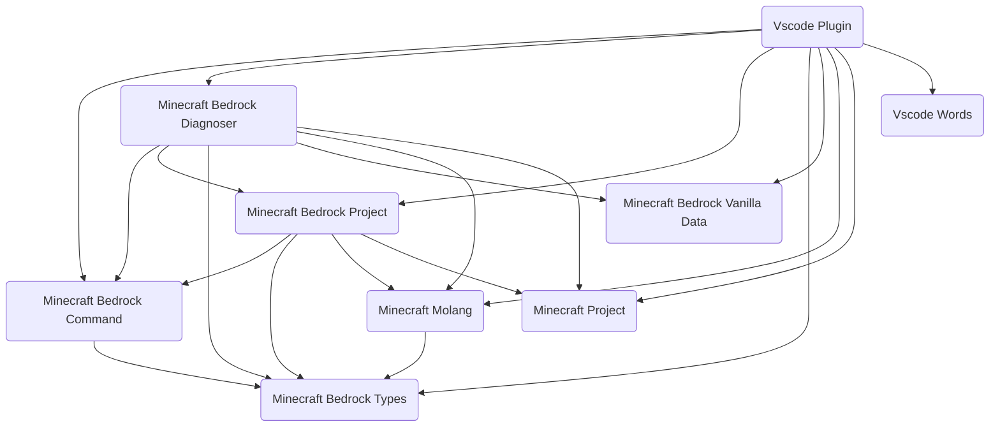

# Dependecy Graph

```mermaid
graph TD
    bc_minecraft_bedrock_command --> bc_minecraft_bedrock_types

    bc_minecraft_molang --> bc_minecraft_bedrock_types

    bc_minecraft_bedrock_project --> bc_minecraft_bedrock_command
    bc_minecraft_bedrock_project --> bc_minecraft_bedrock_types
    bc_minecraft_bedrock_project --> bc_minecraft_molang
    bc_minecraft_bedrock_project --> bc_minecraft_project

    bc_minecraft_bedrock_diagnoser --> bc_minecraft_bedrock_command
    bc_minecraft_bedrock_diagnoser --> bc_minecraft_bedrock_project
    bc_minecraft_bedrock_diagnoser --> bc_minecraft_bedrock_types
    bc_minecraft_bedrock_diagnoser --> bc_minecraft_bedrock_vanilla_data
    bc_minecraft_bedrock_diagnoser --> bc_minecraft_molang
    bc_minecraft_bedrock_diagnoser --> bc_minecraft_project

    plugin(Vscode Plugin) --> bc_minecraft_bedrock_command(Minecraft Bedrock Command)
    plugin --> bc_minecraft_bedrock_diagnoser(Minecraft Bedrock Diagnoser)
    plugin --> bc_minecraft_bedrock_project(Minecraft Bedrock Project)
    plugin --> bc_minecraft_bedrock_types(Minecraft Bedrock Types)
    plugin --> bc_minecraft_bedrock_vanilla_data(Minecraft Bedrock Vanilla Data)
    plugin --> bc_minecraft_molang(Minecraft Molang)
    plugin --> bc_minecraft_project(Minecraft Project)
    plugin --> bc_vscode_words(Vscode Words)
```